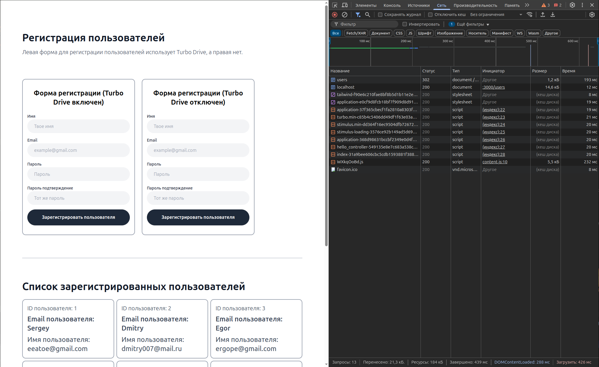
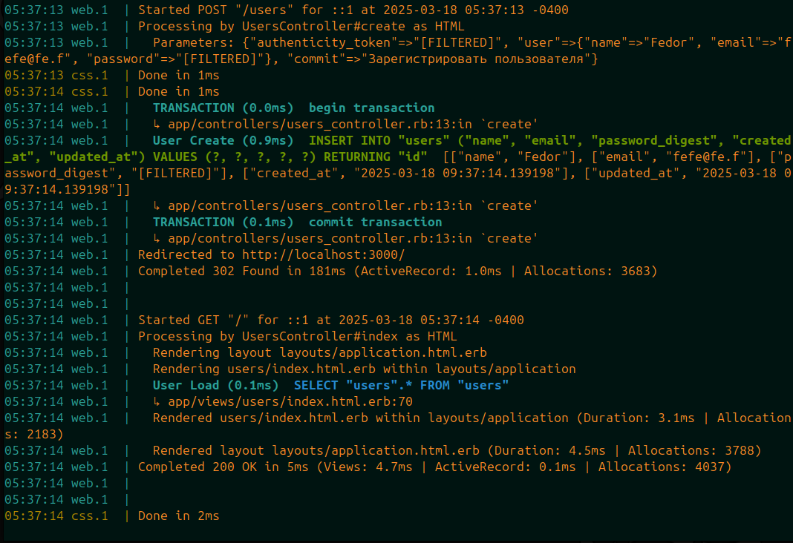
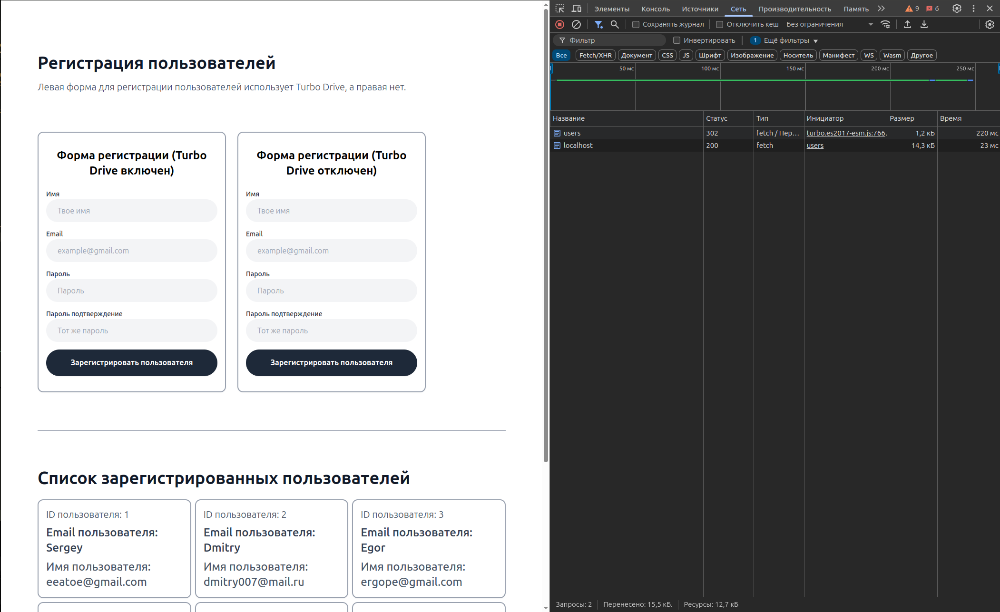
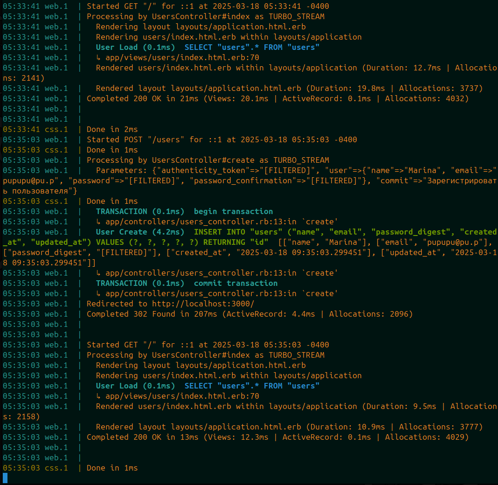

# README

## Скриншоты результатов формы без Turbo Drive

## Скриншоты результатов формы с Turbo Drive

На сетевой панели (Network) хорошо видно разницу в поведении форм с Turbo Drive и без него. Если Turbo Drive отключен, форма отправляет стандартный document-запрос, и сервер возвращает полную HTML-страницу. Это классическое поведение для веб-форм, при котором страница полностью перезагружается.

Если же Turbo Drive включен, форма отправляет XHR-запрос (асинхронный запрос). Это видно по заголовку `Accept`, где указано `text/vnd.turbo-stream.html`. В этом случае сервер возвращает только ту часть страницы, которая должна измениться, и Turbo Drive динамически обновляет её без перезагрузки. Это делает взаимодействие с приложением быстрым и плавнып.
